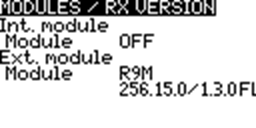

# Версія

### Версія

На екрані **Версія** відображається інформація про поточну версію EdgeTX, яка використовується:

<figure><figcaption>
Екран Версія
</figcaption></figure>

* **FW** - Назва прошивки
* **VERS** - Версія прошивки
* **NAME** - Кодове імʼя прошивки
* **DATE** - Дата й час компіляції прошивки

### Параметри прошивки

Щоб переглянути параметри збірки, які були ввімкнені під час компіляції, виділіть параметри **\[Опції Firmware]** і натисніть кнопку **\[Enter]**.

<figure><figcaption>
Екран параметрів прошивки
</figcaption></figure>


Повний список параметрів збірки можна знайти тут: [https://github.com/EdgeTX/edgetx/wiki/Compilation-options](https://github.com/EdgeTX/edgetx/wiki/Compilation-options)


### **Модулі / Версія RX**

Щоб переглянути інформацію про активовані модулі RX для поточної вибраної моделі, виділіть опцію **\[Модулі / Версія RX]** і натисніть кнопку **\[Enter]**.

<figure><figcaption>
Екран Модулі / Версія RX - Внутрішній ELRS
</figcaption></figure>

<figure><figcaption>
Екран Модулі / Версія RX - Зовнішній FrSky R9 ACCESS
</figcaption></figure>

